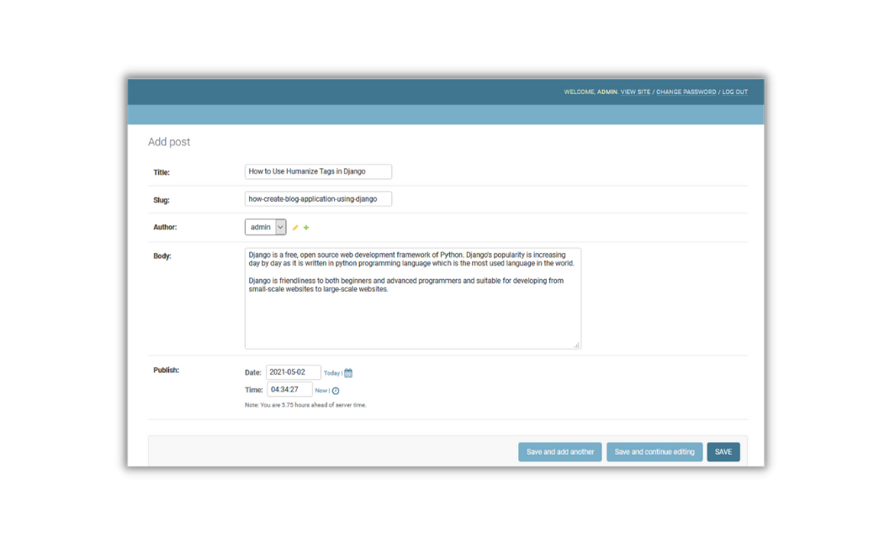
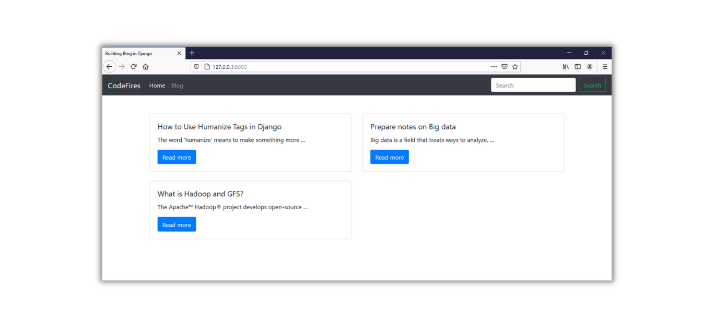
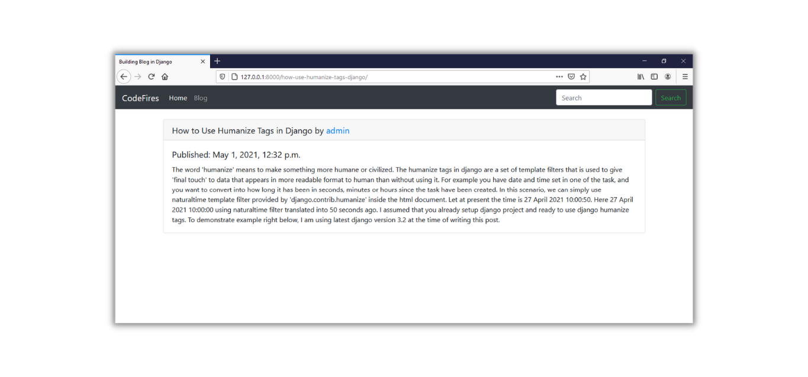

# Creating a Blog Application using Django
__This is the example for the project discussed in the blog post: [How to Create a Blog Application Using Django](https://codefires.com/how-create-blog-application-using-django/)__


## To run this project follow these steps:
```javascript
git clone https://github.com/thecodefires/django-blog.git
```
```python
pip install -r requirements.txt
```
```python
python manage.py migrate
```
```python
python manage.py runserver
```
## Screenshots of the blog application:

  



